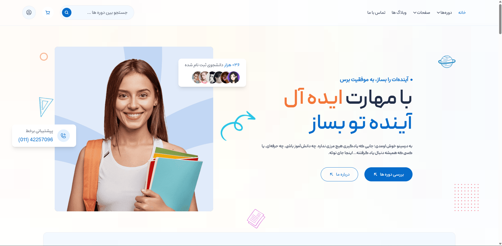

<!-- README HTML for Darsino project
     Replace USERNAME and image paths (assets/home.png or Darsino.png) as needed.
-->

  <h1 style="font-size:32px; margin-bottom:4px;">🎓 پروژه <strong>درسینو</strong> – سایت فروش پکیج‌های آموزشی</h1>
  
وب‌سایتی برای عرضه، مدیریت و فروش دوره‌ها و پکیج‌های آموزشی، توسعه‌داده‌شده با <strong>Django</strong>.

  

  <!-- Demo image (change path to your image inside repo, e.g. assets/home.png) -->
  <h2 style="font-size:20px; margin-bottom:6px;">📸 دموی پروژه</h2>
  

    
    
(تصویر را در مسیر پروژه قرار دهید — مثلا <code>assets/home.png</code>)

  

  

  <h2 style="font-size:20px;">🚀 ویژگی‌ها</h2>
  <ul>
    <li>سیستم ثبت‌نام و ورود کاربران</li>
    <li>فهرست و صفحه جزئیات پکیج‌های آموزشی</li>
    <li>افزودن به سبد خرید و فرایند خرید</li>
    <li>داشبورد مدیریت دوره‌ها برای ادمین</li>
    <li>طراحی واکنش‌گرا (Responsive)</li>
  </ul>

  

  <h2 style="font-size:20px;">🛠 تکنولوژی‌ها</h2>
  
Python · Django · HTML · CSS · JavaScript · Bootstrap/Tailwind · SQLite/MySQL · Git

  

  <h2 style="font-size:20px;">📂 ساختار پیشنهادی پوشه‌ها</h2>
  <pre style="background:#f6f8fa; padding:12px; border-radius:6px; overflow:auto;">
Darsino/
│
├── Darsino/            # تنظیمات پروژه (settings.py, urls.py, wsgi/asgi)
├── accounts/           # اپ مربوط به کاربران (auth)
├── courses/            # اپ مربوط به دوره‌ها/پکیج‌ها
├── static/             # فایل‌های استاتیک (css/js/images)
├── templates/          # قالب‌های HTML
└── assets/             # تصاویر و اسکرین‌شات‌ها
  </pre>

  

  <h2 style="font-size:20px;">⚙️ نصب و اجرا (Local)</h2>

  <h3 style="margin-bottom:6px;">1. کلون کردن مخزن</h3>
  <pre style="background:#f6f8fa; padding:12px; border-radius:6px;">git clone https://github.com/aliazargoon5960/Darsino.git
cd Darsino</pre>

  <h3 style="margin-bottom:6px;">2. ساخت و فعال‌سازی محیط مجازی</h3>
  <pre style="background:#f6f8fa; padding:12px; border-radius:6px;">
python -m venv venv
# ویندوز:
venv\Scripts\activate
# لینوکس / مک:
source venv/bin/activate
  </pre>

  <h3 style="margin-bottom:6px;">3. نصب وابستگی‌ها</h3>
  <pre style="background:#f6f8fa; padding:12px; border-radius:6px;">pip install -r requirements.txt</pre>

  <h3 style="margin-bottom:6px;">4. مایگریشن و اجرای سرور</h3>
  <pre style="background:#f6f8fa; padding:12px; border-radius:6px;">python manage.py migrate
python manage.py runserver</pre>

  
سپس برنامه در <code>http://127.0.0.1:8000/</code> در دسترس خواهد بود.

  

  <h2 style="font-size:20px;">🔧 نکات توسعه</h2>
  <ul>
    <li>تنظیمات حساس مانند <code>SECRET_KEY</code> و تنظیمات دیتابیس را در فایل .env نگه دارید.</li>
    <li>در محیط تولید از سرورهای WSGI/ASGI (مثل Gunicorn + Nginx) استفاده کنید.</li>
    <li>استفاده از <code>collectstatic</code> برای مدیریت فایل‌های استاتیک در تولید.</li>
  </ul>

  

  <h2 style="font-size:20px;">🧑‍💻 توسعه‌دهنده</h2>
  
<strong>علی زارعگون</strong> · <a href="https://github.com/aliazargoon5960" target="_blank">GitHub</a>

  

  <h2 style="font-size:20px;">📄 لایسنس</h2>
  
این پروژه تحت مجوز <strong>MIT</strong> منتشر شده است. برای اطلاعات بیشتر به فایل <code>LICENSE</code> مراجعه کنید.

  
(برای شخصی‌سازی: متن‌های داخل <code>code</code> و مسیر تصویر را مطابق پروژه خود تغییر دهید.)

